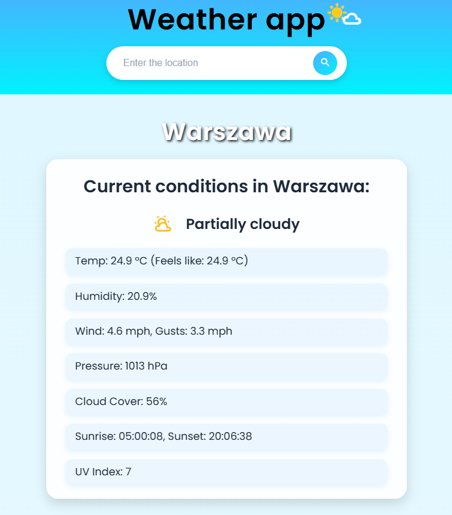
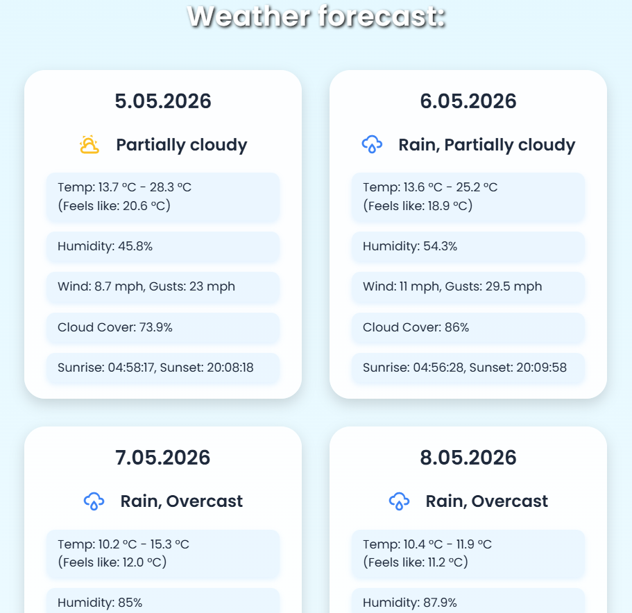

# 🌤️ Cloudora Weather App

A modern weather web application that provides real-time weather data and a 14-day forecast for any selected location. The project is built as a monorepo with a clear separation between frontend and backend responsibilities.

The application includes a user-friendly interface with unit conversion (Celsius <-> Fahrenheit), error handling, smooth animations and many more.

---

## 📸 Preview

### 🌦️ Current weather

 

### 📊 Forecast

---

## ✨ Features

### 🌍 Weather functionality

- Current weather data for any city
- 14-day weather forecast
- Integration with **Visual Crossing API** (external API)
- Backend proxy layer (BFF pattern)

### 🎨 Frontend experience

- Modern, clean UI design
- Loading spinner animation during data fetching
- Visual error handling (e.g. invalid city or network error)
- Temperature unit switch (°C / °F) via UI toggle
- Weather icons using **Material Design Icons (MDI)** for better UX

### ⚙️ Architecture & code quality

- Monorepo structure (frontend + backend separation)
- Clean Architecture principles (separation of concerns, maintainable structure)
- Clean code principles (e.g. DRY, modular and reusable code, readability focus)
- ESLint for static code analysis
- Prettier for consistent formatting
- Modular JavaScript structure (vanilla JS + Webpack bundler)

### 🔒 Backend & security

- Node.js + Express backend
- Backend-for-Frontend (BFF) / middleware layer
- Secure API key management using environment variables (Render)
- CORS enabled for secure cross-origin communication
- Planned: rate limiting for request control

### 🚀 Planned improvements

- Full mobile responsiveness (currently optimized for desktop/laptops)
- Redis caching layer to reduce external API calls and improve performance
- Enhanced performance optimizations and scalability improvements

---

## 🔄 How it works

1. User enters a city in the frontend UI
2. Frontend sends request to backend (Express BFF layer)
3. Backend communicates with Visual Crossing API
4. Data is processed and returned to frontend
5. UI dynamically renders the weather forecast

---

## 🛠️ Tech Stack

### Frontend

- HTML
- CSS (modular structure + reset.css)
- Vanilla JavaScript (ES6+)
- Webpack (module bundler) with `webpack-merge`
- ESLint
- Prettier
- Material Design Icons (MDI)

### Backend

- Node.js
- Express.js
- Visual Crossing Weather API
- CORS middleware

### Deployment

- Frontend: Netlify
- Backend: Render

### Dev Tools

- Git & GitHub (VCS / monorepo)

---

## 🔐 Security Notes

- API key is stored as environment variable (not exposed in source code)
- Backend acts as a secure proxy between frontend and external API

---

## License

This project is licensed under the MIT License - see the LICENSE file for details.

---

## 🌐 Live Demo

_Live version is available in the **About section of this repository** 👉 Netlify deployment link_
